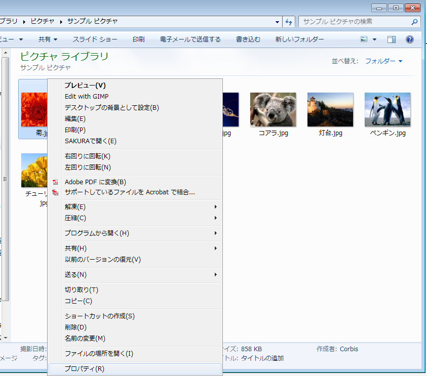
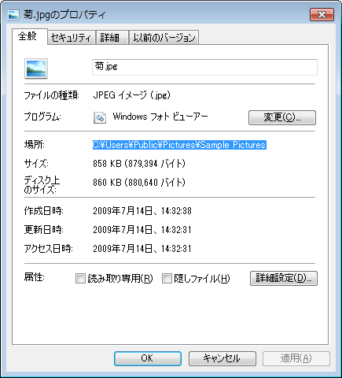

# ファイルパスの確認の仕方

サンプルプログラムで画像を表示させるプログラムがありました．

画像のファイルパスの仕方について説明します．

## プロパティを開く

表示したい画像の上で右クリック→プロパティを表示



## 「場所」をコピー

プロパティをクリックすると，画像に関する情報が閲覧できます．



このウインドウの中の**「場所」と書いてある部分をコピーし，末尾に画像名を付け加えます．**

この画像の場合だと，

`C:\Users\Public\Pictures\Sample Pictures\菊.jpg`

になります．

## \をひとつずつ増やす

C++プログラム中では￥や\などの字は特別な意味を持ちます．ファイルパスのような文字列として￥または\を入力したいときは**￥(\\)を2つ連続して入力します．**

従って，先ほどの画像のパスは

`C:\\Users\\Public\\Pictures\\Sample Pictures\\菊.jpg`

として入力をします．

実際のプログラムでは以下のように書きます．

```C++
src_img = cv::imread("C:\\Users\\Public\\Pictures\\Sample Pictures\\菊.jpg", 1);
```

少し違和感を感じるかもしれませんが，ファイルパスを指定するときはこのように書くことを覚えておいてください．