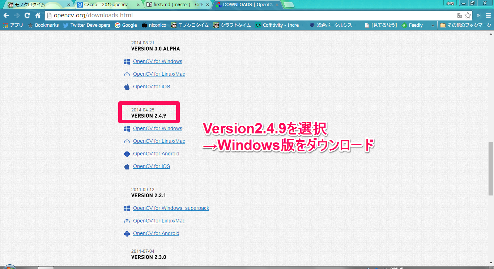
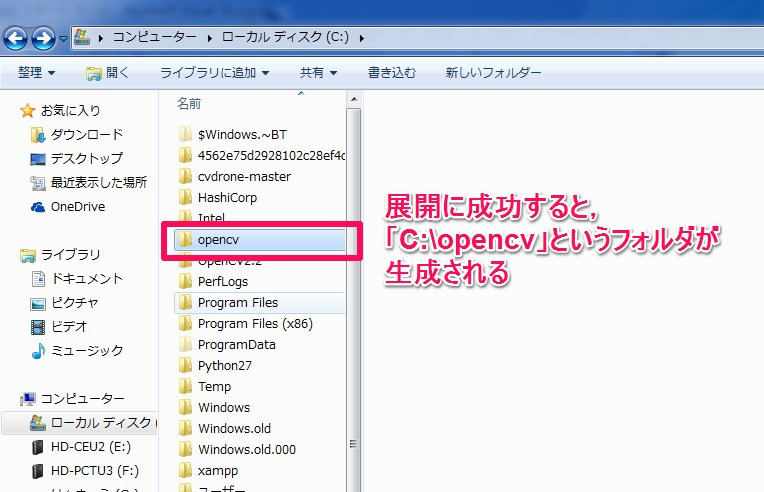
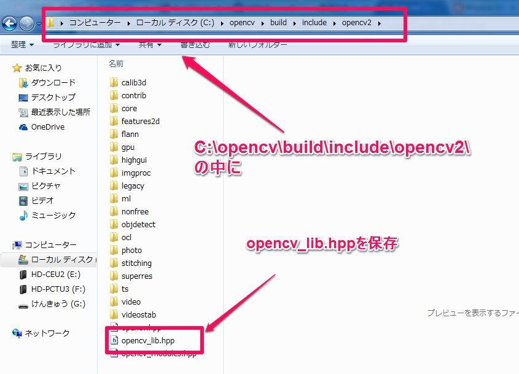
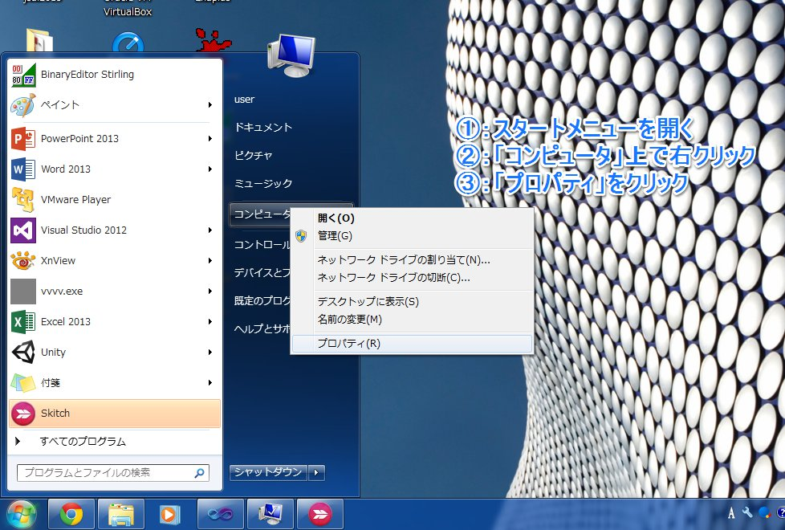
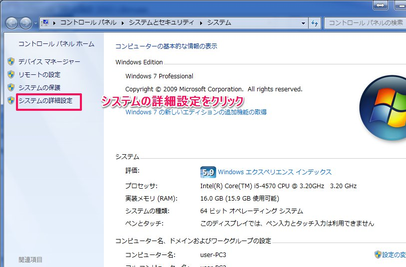
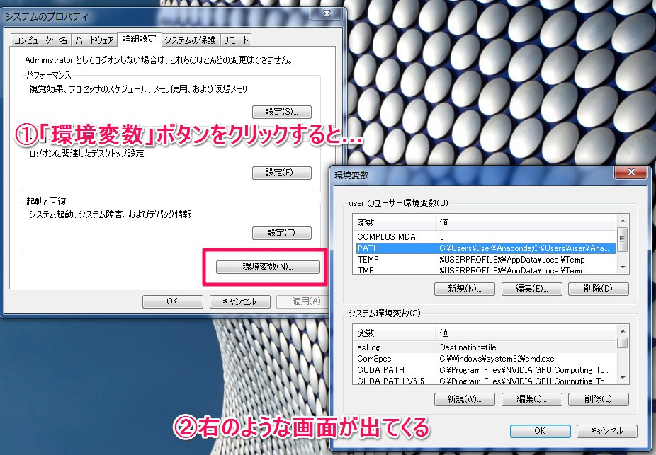
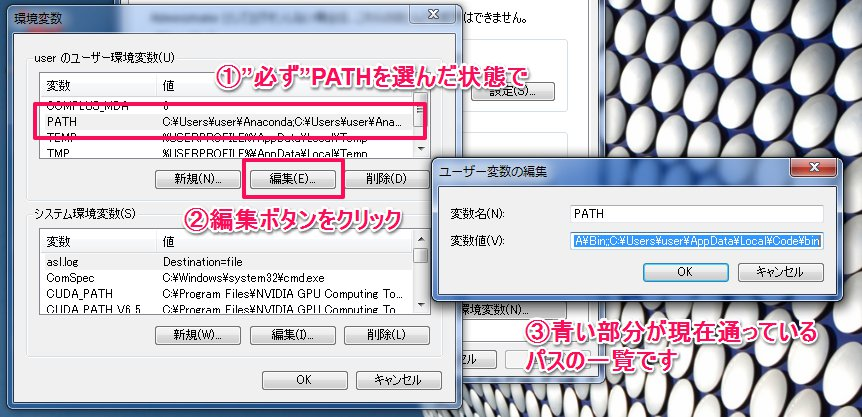

# OpenCVとは？

## 概要

`OpenCV`とは，オープンソースのコンピュータビジョン(CV:Computer Vision)ライブラリです．

>オープンソース 【 open source 】 オープンソースソフトウェア

>OSS / Open Source Software
オープンソースとは、ソフトウェアの設計図にあたるソースコードを、インターネットなどを通じて無償で公開し、誰でもそのソフトウェアの改良、再配布が行えるようにすること。また、そのようなソフトウェア。

[IT用語辞典 e-words「オープンソース」](http://e-words.jp/w/%E3%82%AA%E3%83%BC%E3%83%97%E3%83%B3%E3%82%BD%E3%83%BC%E3%82%B9.html)から引用

ライブラリとは，便利なプログラムをまとめたセットの事を指します．

例えば，OpenCVには以下の様なプログラムがセットされています．

* 顔認識用プログラム
* カラー画像を白黒にするプログラム
* 読み込んだ画像の輪郭だけを抽出するプログラム

これらのプログラムは，自分の手でプログラムするには余りに面倒です．

ここでOpenCVライブラリを使うことで，セットされているプログラムの中から使いたいものを選べば簡単にプログラムが書けるというわけです．

また，OpenCVはオープンソースですから，ソースコードを見ることで画像処理のプログラムの構造を勉強することもできます(中々読みにくいコードのものもあります)

## インストール

OpenCVのダウンロードサイトはこちら

http://opencv.org/downloads.html

この中の，OpenCV2.4.9 for Windowsをダウンロードして下さい．

クリックして暫く待っていると，ダウンロードが始まります．

`opencv-2.4.9.exe`というファイルがダウンロードできたら，exeファイルをダブルクリックし実行します．

インストールは以下のURLの記述に沿って行います．

http://physics-station.blogspot.jp/2013/03/opencv-visual-studio.html

exeファイルを実行すると，OpenCVをどこにインストールするか訪ねてきますので，「C:\」を指定してください(\は半角の￥マークでも構いません)

インストールに成功すると，Cドライブ直下に`opencv`というフォルダが生成されます．

[ここ](https://onedrive.live.com/redir?resid=7ACA20D611380471!3643&authkey=!AJwzntpIxwuQYKw&ithint=folder%2chpp)から`opencv_lib.hpp`をダウンロードし，`C:\opencv\build\include\opencv2`の中に配置します．

次に，OpenCVがきちんとコンピュータで使えるように，opencvが保存されている場所をコンピュータに教えてあげる必要があります．この作業の事を「パスを通す」といいます．

まず，スタートボタンをクリックし，右の「コンピューター」という文字の上で右クリックをして「プロパティ」を選びます．

上のようなウィンドウが出てきたら，「システムの詳細設定」をクリックします．

「システムの詳細設定」をクリックするとシステムのプロパティが開きます．

このウィンドウの右下にある「環境変数」というボタンをクリックします．

環境変数ウィンドウでパスを通すことができます．

**環境変数ウィンドウでは，コンピュータにとってとてもセンシティブな操作をします．操作を間違わないようにしてください．**

「ユーザー環境変数」の表の中の「PATH」を選択した状態で編集ボタンをクリックします．

すると「ユーザー変数の編集」というウィンドウが開きます．

このウィンドウの中の青い部分が，現在あなたのコンピュータに通っているパスの一覧になります．

このパスの末尾に，`C:\opencv\build\x86\vc10\bin`というパスを追加してください．

既に通っているパスの末尾に￥マークがない場合は，`\C:\opencv\build\x86\vc10\bin`を追加してください．

追加してOKを押すと，パスを通す作業は終了です．

開いている全てのウィンドウを，OKボタンを押して閉じてください．

